# Proyecto de Aplicación de Series de TV
Autores: **Víctor Sánchez Nogueira** y **Joel Figueirido Molares**

## 1. Introducción

### 1.1 Descripción del Proyecto
Este proyecto tiene como objetivo desarrollar una aplicación para gestionar y consultar información sobre series de televisión. La aplicación permite a los usuarios buscar series por nombre, ver detalles como el reparto, los episodios, el estado de la serie, calificaciones y más.

#### Funcionalidades principales:
- **Búsqueda de series**: Los usuarios pueden introducir el nombre de una serie y recibir información detallada sobre la misma.
- **Visualización de episodios**: Permite a los usuarios consultar los episodios de la serie seleccionada, con detalles como fecha de emisión, título y estado del episodio.
- **Consulta del reparto (Cast)**: Se muestra la lista de actores que participan en la serie, incluyendo los personajes que interpretan.
- **Información adicional**: Se incluye información complementaria como el género, idioma, estado de emisión, calificación, fecha de estreno y horario de emisión.

### 1.2 Descripción de la API
La aplicación obtiene los datos desde una **API pública** que proporciona información detallada sobre series de televisión. La API expone varios **endpoints** que permiten acceder a la información necesaria, como detalles de series, episodios, y el reparto de actores.

#### Endpoints utilizados:
- **GET /singlesearch/shows?q={nombre_serie}**: Devuelve la información general de una serie específica buscando por nombre.
- **GET /shows/{id}/episodes**: Devuelve una lista con los episodios de la serie identificada por el `id`.
- **GET /shows/{id}/cast**: Devuelve el reparto de la serie identificada por el `id`.

### 1.3 Ejemplo de solicitud API en POSTMAN
Utilizamos postman para realizar las peticiones a la API y obtener la información para contrastar con el progreso de nuestro programa en nuestro caso,creamos una colección llamada **TVMazeApi** y dentro de ella creamos tres peticiones get que serán las que utilizaremos en nuestro programa.
#### Ejemplo de URL para obtener información de una serie:
- **URL**: `https://api.tvmaze.com/singlesearch/shows?q=girls`
- **Método**: `GET`

**Captura de Postman**:
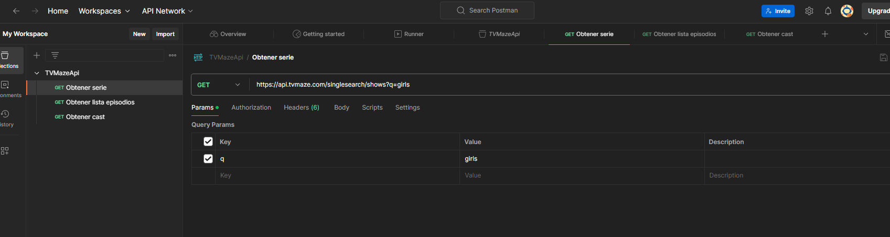

#### Ejemplo de URL para obtener episodios de una serie:
- **URL**: `https://api.tvmaze.com/shows/1/episodes`
- **Método**: `GET`

**Captura de Postman**:
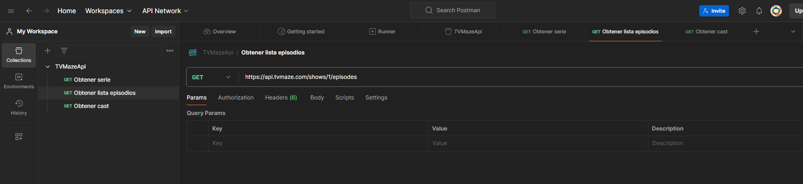

#### Ejemplo de URL para obtener el reparto de una serie:
- **URL**: `https://api.tvmaze.com/shows/1/cast`
- **Método**: `GET`

**Captura de Postman**:
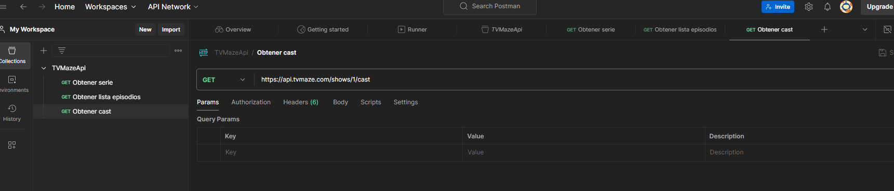

### 1.4 Tecnologías utilizadas
Este proyecto ha sido desarrollado con las siguientes tecnologías:
- **Java**: Lenguaje de programación principal utilizado.
- **JavaFX**: Para la creación de la interfaz gráfica de usuario (GUI).
- **FXML**: Lenguaje utilizado para diseñar las vistas de la aplicación.
- **Maven**: Utilizado para la gestión de dependencias y la construcción del proyecto.
- **API REST**: Para obtener los datos de series a través de solicitudes HTTP.

## 2. Estructura del Proyecto

El proyecto sigue el patrón de arquitectura **MVC (Modelo-Vista-Controlador)**. Cada una de estas capas tiene una responsabilidad clara:

- **Modelo**: Esta capa gestiona la lógica del negocio. Aquí se define la estructura de los datos (series, episodios, reparto) y las interacciones con la API.
- **Vista**: Los archivos **FXML** definen la interfaz gráfica. Esta capa gestiona lo que el usuario ve y con lo que interactúa.
- **Controlador**: Gestiona la interacción entre el modelo y la vista. Los controladores son responsables de manejar eventos de usuario (como búsquedas) y procesar los datos obtenidos desde el modelo.

## <u>Estructura del código</u>

## 2.1 Descripción de las clases en el paquete `controlador`

1. **`LoginController`**: Esta clase maneja la funcionalidad de inicio de sesión de los usuarios. Permite que los usuarios ingresen sus credenciales y autentica su acceso. También gestiona la navegación hacia la pantalla de series.
    - Métodos clave:
        - `toSerie(ActionEvent actionEvent)`: Navega a la pantalla de series después del inicio de sesión.
        - `registrarUser()`: Registra un nuevo usuario.
        - `acceder(ActionEvent actionEvent)`: Autentica al usuario y navega a la pantalla de series.

2. **`LinkPaginasController`**: Controla la navegación entre diferentes pantallas dentro de la aplicación. Administra las transiciones entre la pantalla de inicio de sesión, la pantalla de reparto, y otras vistas relacionadas con las series.
    - Métodos clave:
        - `toCast(ActionEvent actionEvent)`: Navega a la pantalla de reparto.
        - `toLogin(ActionEvent actionEvent)`: Navega a la pantalla de inicio de sesión.
        - `guardarSerie(Serie serie)`: Guarda la información de una serie en un archivo XML.
        - `cargarSerie()`: Carga la información de la serie desde un archivo XML.

3. **`JSONHandler`**: Se encarga de la lectura y escritura de datos de los usuarios desde y hacia un archivo. Maneja las credenciales de los usuarios guardadas en `Users.txt`.
    - Métodos clave:
        - `leerUsers()`: Lee los datos de los usuarios desde el archivo `Users.txt`.
        - `crearUser(String user, String pswd)`: Escribe un nuevo usuario en `Users.txt`.

4. **`LZ78`**: Implementa los algoritmos de codificación y decodificación LZ78, un método de compresión de datos. Es utilizado en el procesamiento de datos dentro de la aplicación.
    - Métodos clave:
        - `decode(String encodedData)`: Decodifica una cadena utilizando el algoritmo LZ78.
        - `encode(String input)`: Codifica una cadena utilizando el algoritmo LZ78.

5. **`CastController`**: Maneja la funcionalidad de la pantalla de reparto. Administra la visualización de los actores y personajes que forman parte del reparto de la serie seleccionada.

6. **`Conexion`**: Se encarga de gestionar las conexiones con la base de datos o API. Esta clase maneja las solicitudes de datos relacionadas con las series y su reparto, interactuando con la base de datos subyacente o el servicio web.

7. **`DictionaryEntry`**: Representa una entrada en el diccionario utilizado en el algoritmo de compresión LZ78. Esta clase modela una unidad de información clave en el proceso de codificación y decodificación de datos.

8. **`EpisodiosController`**: Gestiona la funcionalidad de la pantalla de episodios. Permite visualizar los episodios de una serie seleccionada y proporciona detalles como el título, la fecha de emisión y el estado de cada episodio.

---

## 2.2 Relación entre las clases

- **`LoginController`** se relaciona principalmente con **`LinkPaginasController`**, ya que después del inicio de sesión , navega a otras pantallas (series o reparto).

- **`LinkPaginasController`** actúa como un controlador de navegación que conecta diferentes pantallas, como las gestionadas por **`CastController`** y **`EpisodiosController`**. Se asegura de que la interfaz de usuario cambie de manera eficiente entre estas vistas.

- **`CastController`** y **`EpisodiosController`** están más enfocados en mostrar la información específica de cada serie (reparto y episodios), mientras que **`Conexion`** asegura que estos controladores obtengan los datos correctos desde la API o la base de datos.

- **`JSONHandler`** y **`LZ78`** ayudan en la gestión de datos. El primero se centra en la manipulación de los datos de usuarios, y el segundo proporciona soporte para la compresión y descompresión de información dentro de la aplicación. **`DictionaryEntry`** se usa internamente en los procesos de compresión de **`LZ78`**.

## 2.3 Descripción del paquete `modelo`

El paquete `modelo` se encarga de gestionar la lógica de negocio relacionada con las series de televisión, episodios y actores. Aquí se definen las clases que modelan los datos que se obtienen de la API o de la base de datos.

## 2.4 `src/main/resources` – Almacenamiento de FXML y Recursos

La carpeta `src/main/resources` contiene todos los archivos necesarios para la interfaz gráfica de usuario y otros recursos estáticos.

### Subcarpetas clave y archivos:

1. **`resources/edu/badpals/controlador/`**: Esta subcarpeta contiene los archivos **FXML**, los cuales definen la estructura y diseño de la interfaz gráfica de la aplicación.

    - **Archivos FXML principales**:
        - **`login.fxml`**: Define el diseño de la pantalla de inicio de sesión.
        - **`serie.fxml`**: Contiene el layout de la pantalla principal donde se visualizan las series.
        - **`episodios.fxml`**: Define la estructura de la pantalla que muestra la lista de episodios de una serie.
        - **`cast.fxml`**: Contiene el layout de la pantalla de reparto, donde se muestra la lista de actores de la serie.

   

2. **`data/`**: Esta carpeta almacena los datos persistentes que utiliza la aplicación, como las credenciales de los usuarios y la información guardada para trabajar offline mediante el caché.

    
        

### Relación entre los controladores y los archivos FXML

Cada controlador está asociado con un archivo FXML. Por ejemplo:
- **`LoginController`** se asocia con **`login.fxml`** para gestionar los eventos y la interacción en la pantalla de inicio de sesión.
- **`EpisodiosController`** utiliza **`episodios.fxml`** para mostrar la lista de episodios de una serie.
- **`CastController`** utiliza **`cast.fxml`** para mostrar el reparto de la serie.

Esto garantiza una separación clara entre la lógica del programa y la interfaz de usuario, facilitando el mantenimiento y la expansión de la aplicación.

# <u>Manual para Desarrolladores</u>

## Requisitos del Sistema
### Antes de comenzar, asegúrate de que tienes instalados los siguientes componentes en tu sistema:

1. JDK 21: Necesario para compilar y ejecutar aplicaciones Java.
2. JavaFX 17: Usado para la interfaz gráfica de usuario (GUI) en Java.
3. Maven: Herramienta para la gestión de proyectos y dependencias en Java.
4. Git: Sistema de control de versiones para gestionar el código fuente.

## Instrucciones de Instalación

### 1. Sitúate donde quieras crear la app:

```bash
cd C:\Users\nombredeusuario\Escritorio
```
### 2. Crea un directorio donde almacenar la app:
    
```bash
  mkdir Directorio
```
### 3.Sitúate en el directorio:
        
    ```bash
    cd Directorio
    ```
### 4.Instala los requisitos:
#### Instalar JDK 21:

- Si no tienes JDK instalado, descárgalo e instálalo desde Oracle JDK 21.
- Durante la instalación, asegúrate de seleccionar la opción de añadir Java al PATH para que puedas usarlo desde la línea de comandos.

- Verifica la instalación de Java ejecutando el siguiente comando en la terminal:
```bash
java -version

```
#### Instalar JavaFX 17:

- Descarga JavaFX 17 desde [Gluon](https://gluonhq.com/products/javafx/).
- Descomprime el archivo descargado en un directorio de tu elección.
- Debes configurar las variables de entorno para JavaFX. En Windows, añade la ruta del directorio lib de JavaFX a la variable de entorno PATH.
- Para verificar, puedes ejecutar el siguiente comando, reemplazando ruta_a_javafx por la ruta de la carpeta lib:
```bash
set PATH=%PATH%;ruta_a_javafx\lib
```
#### Instalar Maven:
- Si no tienes Maven instalado, descárgalo e instálalo desde [Apache Maven](https://maven.apache.org/download.cgi).
- Descomprime el archivo descargado en un directorio de tu elección.
- Añaade la ruta de la carpeta bin de Maven a la variable de entorno PATH.
- Para verificar la instalación, ejecuta el siguiente comando en la terminal:
```bash
mvn -version
```
#### Instalar Git:
- Si no tienes Git instalado, descárgalo e instálalo desde [Git](https://git-scm.com/downloads).
- Durante la instalación, asegúrate de seleccionar la opción de añadir Git al PATH para que puedas usarlo desde la línea de comandos.
- Verifica la instalación de Git ejecutando el siguiente comando en la terminal:
```bash
git --version
```
### 5. Clona el repositorio de la aplicación:
```bash
   git clone https://github.com/Acceso-a-Datos2024/proyecto-ud01-tvmaze.git
```
### 6. Sitúate en el directorio del proyecto:
```bash
    cd proyecto-ud01-tvmaze
  ```
### 7. Instala las dependencias del proyecto:
```bash
    mvn  install
```
### 8. Ejecuta la aplicación:
```bash
  
```
## Notas:
- Si solo vas a usar el programa sin necesidad de realizar cambios en el código, asegúrate de tener JDK 21, JavaFX 17 y el archivo JAR ejecutable en la carpeta del proyecto.
- Git es opcional; puedes descargar el ZIP del repositorio y extraerlo sin necesidad de clonar.

## Para Crear el JAR
- mvn clean package
## Para ejecutar con el JAR
- java --module-path "C:\Users\a23joelfm\openjfx-21.0.5_windows-x64_bin-sdk\javafx-sdk-21.0.5\lib" --add-modules javafx.controls,javafx.fxml -jar .\target\controlador-1.0-SNAPSHOT.jar


# <u>Manual de Usuario</u>

## Inicio de Sesión
1. Al abrir la aplicación, se mostrará la pantalla de inicio de sesión.
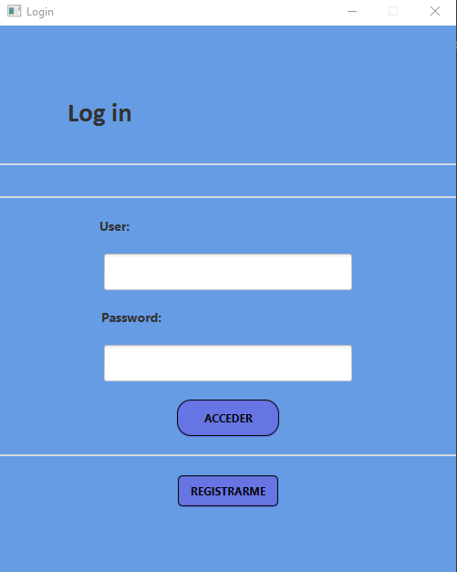
2. Introduce tus credenciales (usuario y contraseña) y haz clic en **Acceder**.
- Si intentas acceder con credenciales incorrectas, se mostrará un mensaje de error.
- Si no tienes una cuenta, puedes registrarte haciendo clic en **Registrarse**.
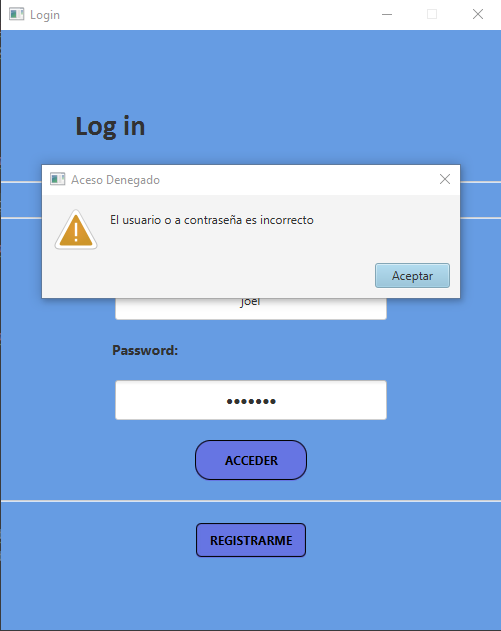
- Cuando creas una contraseña e usuario, esta se cifrará y almacenará para proteger tu información.
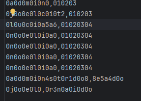
3. Después de iniciar sesión correctamente, se mostrará una ventana para restaurar la sesión anterior o iniciar una nueva.
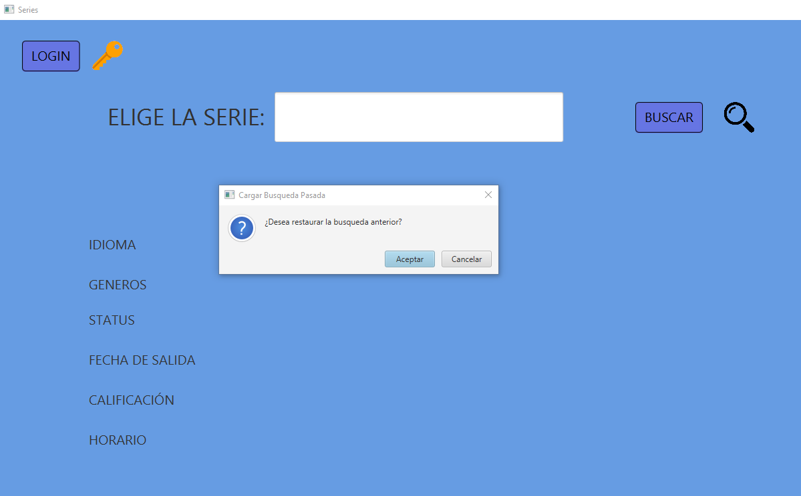
- Si eliges **Aceptar**, se cargarán los datos de la sesión anterior.
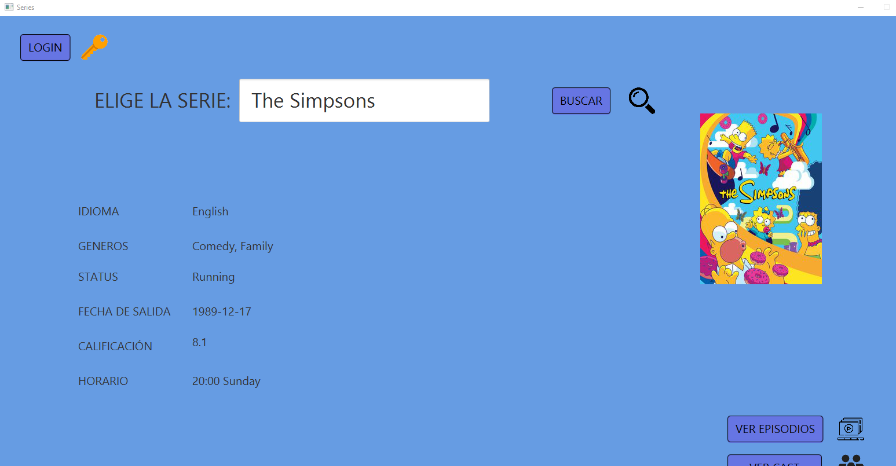
- Si eliges **Cancelar**, se mostrará la pantalla principal de la aplicación.
4. Busca una serie por su nombre en el campo de búsqueda y haz clic en **Buscar**.
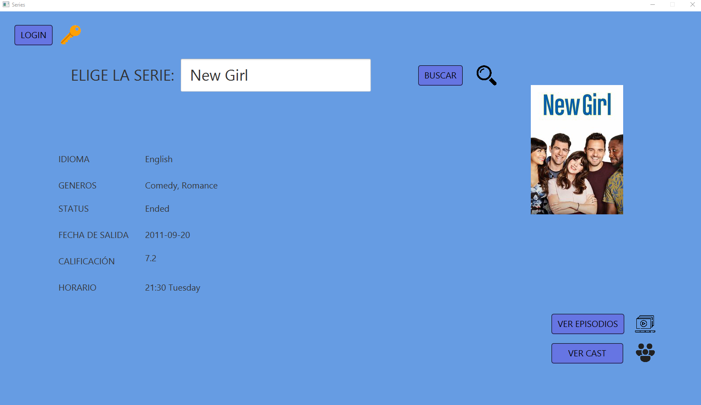
5. Si pulsas en ver episodios, se mostrará una lista con los episodios de la serie seleccionada ordenados por temporada y número de episodio.
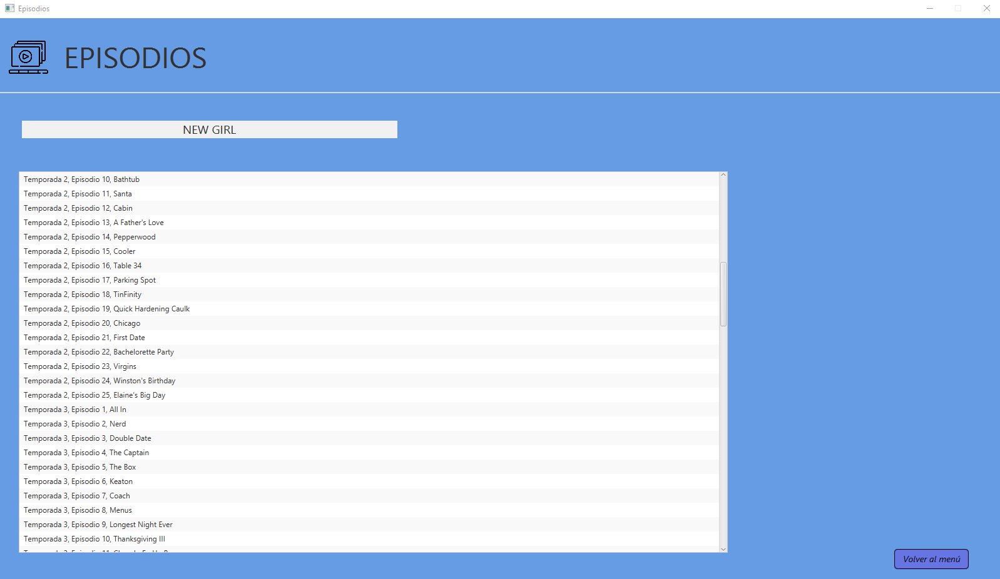
6. Si pulsas en **Ver Cast** , se mostrará una lista con los actores que participan en la serie y los personajes que interpretan.
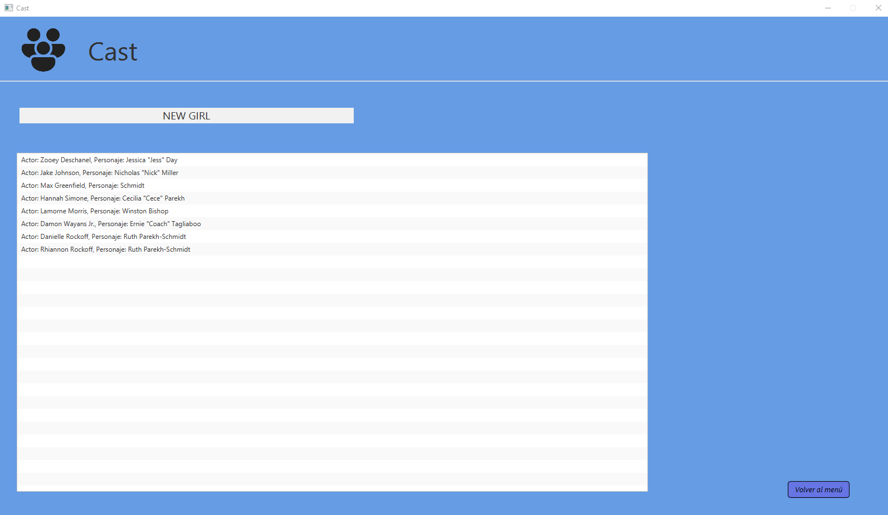

# Extras Realizados
1. **Ordenación de resultados** de las consultas y almacenaje de los datos.
- Las series aparecen ordenadas por temporada y número de episodio.
2. **Control de errores (errores de ficheros, consultas sin resultados...).
- Se muestran mensajes de error si no se encuentran resultados o si hay problemas con los ficheros.
- Se manejan excepciones para evitar fallos en la aplicación.
- Si el usuario introduce credenciales incorrectas, se muestra un mensaje de error.
- Si el usuario borra el paquete data,este se genera automáticamente.
- Si el usuario borra todos los usuarios,se puede crear uno nuevo sin problemas.
3. **Uso de la aplicación offline** (en lugar de recurrir a la API, carga de ficheros en caché)
- Se almacenan los datos de las series en un archivo XML para poder acceder a ellos sin conexión.
- Si no hay conexión a Internet, la aplicación carga los datos de las series desde el archivo XML.
4. **Almacenamiento del último estado de ejecución** de la aplicación (última consulta y resultados devueltos) 
- Se guarda el estado de la aplicación y despues de iniciar sesión, se pregunta al usuario si desea restaurar la sesión anterior.
- Si el usuario acepta, se cargan los datos de la sesión anterior.
- Si el usuario cancela, se muestra la pantalla principal de la aplicación. 
5. Adición de un login (control de acceso restringido) con usuario y contraseña contenidos en un fichero de Properties.
- Se añade un sistema de inicio de sesión con credenciales almacenadas en un archivo Users.txt.
- Los usuarios deben autenticarse para acceder a la aplicación.
- Si el usuario no tiene una cuenta, puede registrarse y crear un nuevo usuario.
6. Si el contenido se encripta
- Las contraseñas se cifran antes de ser almacenadas en el archivo Users.txt.
- Se utiliza el algoritmo de cifrado LZ78 para proteger la información de los usuarios.

